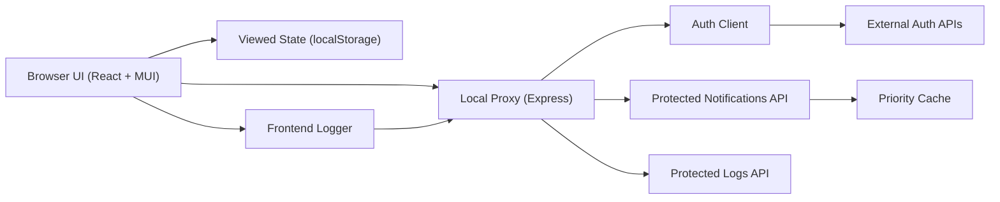

# Campus Notification System

React frontend, Express proxy, and a shared logging package for a campus notification workflow.

Live frontend: [https://nithinkumarkondabattini.github.io/2303A51630/](https://nithinkumarkondabattini.github.io/2303A51630/)

The public GitHub Pages link runs as a static demo because GitHub Pages cannot
host the Express backend. Run the backend locally to use protected API data.

## Architecture



## Local setup

1. Create `notification-app-be/.env` from `notification-app-be/.env.example`.
2. Fill the service credentials in that file. The backend uses
   `http://4.224.186.213/evaluation-service/register` and
   `http://4.224.186.213/evaluation-service/auth` to obtain protected API
   access when the required values are present.
3. Install dependencies:

```bash
cd notification-app-fe && npm install
cd ../notification-app-be && npm install
```

4. Start the backend:

```bash
cd notification-app-be
npm run dev
```

5. Start the frontend in a second terminal:

```bash
cd notification-app-fe
npm run dev
```

6. Open [http://localhost:3000](http://localhost:3000).

If protected credentials are incomplete, the Express backend serves demo
notifications through the same `/api/notifications` routes so the UI remains
usable.

## Included folders

- `notification-app-fe`
- `notification-app-be`
- `logging-middleware`
- `notification-system-design.md`
